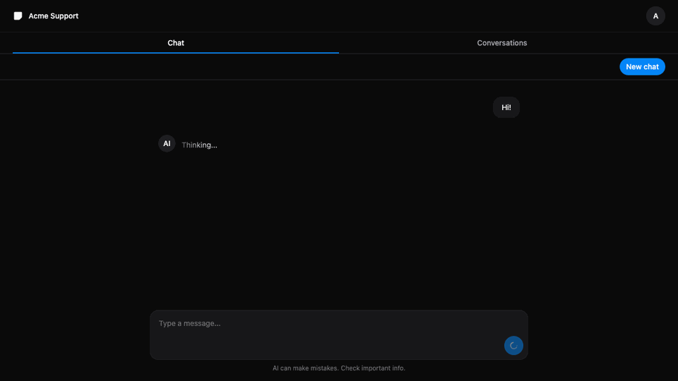

# support-agent

The evening-sized core of a first-line support agent — the agent loop from my
article, not the production harness it is compared against. One NestJS backend
where an LLM answers customers and calls tools itself, a React chat with JWT
login, PostgreSQL, and a bench script that measures what this architecture
actually does.

It greets the customer, answers "where is my order 1234?" from real order data,
answers delivery/returns questions from a small FAQ, and hands the conversation
to a human when asked — or when it stops converging.



## Quickstart

You need three things: Node 22+, Docker, and a model to talk to — an API key
from any OpenAI-compatible provider (OpenRouter is the easy path), or LM Studio
running locally with a model loaded.

```bash
git clone https://github.com/nmrcs/support-agent.git
cd support-agent

# 1. PostgreSQL in Docker. Host port 5433, so it coexists with a local one.
docker compose up -d

# 2. Backend config.
cp apps/backend/.env.example apps/backend/.env
```

Open `apps/backend/.env` and change two lines:

- `LLM_API_KEY` — your provider key. For LM Studio instead, swap the three
  `LLM_` lines for the commented-out block below them.
- `AUTH_JWT_SECRET` — anything long and random (`openssl rand -hex 32`). The
  backend refuses to boot with the example secret unchanged.

For LM Studio: load `qwen/qwen3.5-9b`, 4-bit — MLX on Apple silicon, GGUF
elsewhere — and start its local server, port `1234` by default. The numbers in
[bench/runs.md](bench/runs.md) come from the MLX build. Any other model works
as long as it supports tool calling: the backend sends `tools` with every
request.

```bash
# 3. Frontend config. The default points at localhost:4001 — keep it.
cp apps/frontend/.env.example apps/frontend/.env

# 4. Install, migrate + seed demo customers with orders, run.
npm install
npm run db:reset
npm run dev        # backend on :4001, frontend on :4000
```

Open http://localhost:4000 and log in as `alice@example.com` / `demo`
(`bob@example.com` / `demo` works too). Ask where order `1001` is, then ask
for a human.

## How it works

One turn is a loop: the model either answers or asks for a tool, code runs the
tool, the result goes back to the model, at most three steps.

```
customer message
      │
      ▼
[LLM] ── tool_calls? ──▶ [code runs the tool] ──▶ back to the LLM
  │                        get_order_status
  │                        escalate_to_human
  ▼
final text ──▶ customer
(3 steps without a text answer ──▶ handed to a human)
```

The two tools are plain functions the model is told about
(`apps/backend/src/chat/tools.ts`):

- `get_order_status` looks the order up **for the signed-in customer only** —
  the user id comes from the JWT, never from model output, so no prompt can
  reach another customer's order;
- `escalate_to_human` marks the conversation as taken over; after that the
  agent stays silent.

Everything the agent knows beyond that — greeting, tone, the FAQ, when to
escalate — is one system prompt (`apps/backend/src/chat/prompt.ts`).

The monorepo has three packages: `apps/backend` (NestJS 11, Prisma 7, JWT),
`apps/frontend` (React 19, Vite, HeroUI, Tailwind 4), and `packages/contracts`
(Zod schemas both sides validate against).

## What is deliberately not here

- **No retrieval.** The FAQ is three lines in the system prompt. It stops
  scaling around the point where you have real documentation.
- **No guardrails, no watchdog, no loop detection.** The only limits are three
  steps per turn and fifteen turns per conversation; past either, the
  conversation goes to a human.
- **No streaming.** The reply arrives as one JSON response.
- **No multi-tenancy, roles, or admin UI.** Tools and the prompt are code;
  changing the agent means editing the repo.

Each of these is fine for an evening prototype and wrong for production. The
model also sometimes answers about an order **without calling the tool** — that
is the cost of letting the model decide, and `npm run bench` measures it
instead of hiding it.

## Numbers

`npm run bench` (backend running) replays a fixed four-turn dialog — greeting,
an order that exists, an order that doesn't, a request for a human — eight
times, and writes latency, token counts, and the share of turns where the model
skipped a required tool call to [bench/runs.md](bench/runs.md). The committed
run is Qwen3.5 9B, 4-bit MLX, served by LM Studio on a laptop.

## Author and license

Built solo by Nikita MRCS — [@nmrcs](https://github.com/nmrcs). Every design
decision, every number and every mistake in this repository is mine.

MIT.
